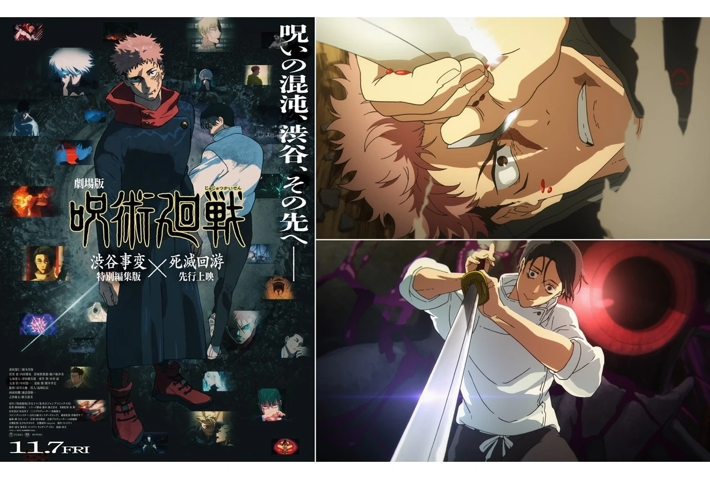
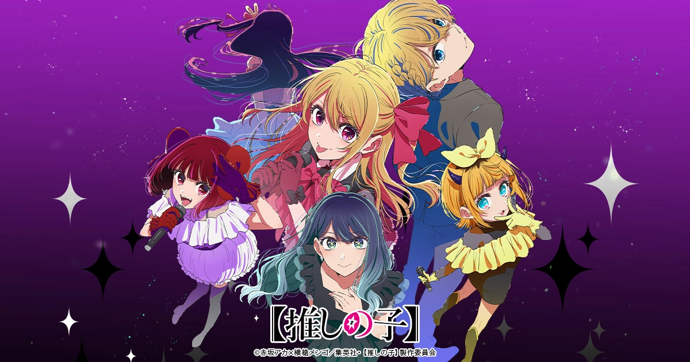
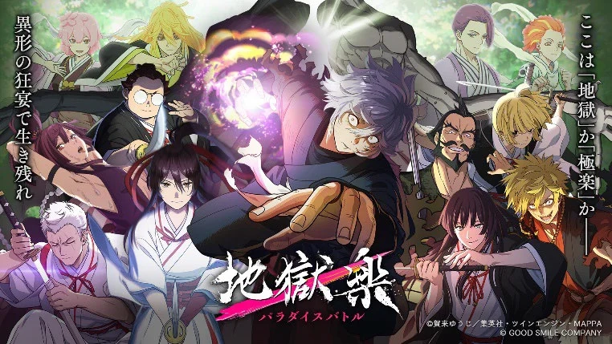
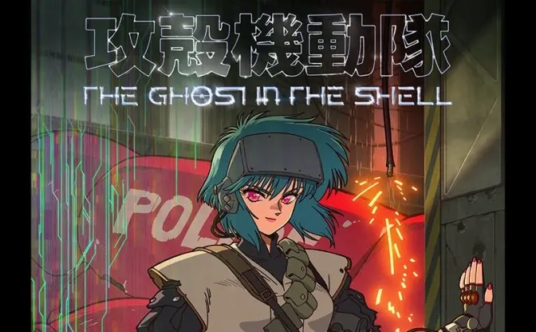

2026年は、社会現象クラスの人気作の続編と、世界的に評価されるシリーズの新作が重なる年になりそうです。

この記事では、2026年に話題になる可能性が高いアニメの中から、今のうちに押さえておきたい5作品を紹介します。

## 目次

- [1. 呪術廻戦 死滅回游（第3期）](#1-呪術廻戦-死滅回游第3期)
- [2. 葬送のフリーレン 第2期](#2-葬送のフリーレン-第2期)
- [3. 推しの子 第3期](#3-推しの子-第3期)
- [4. 地獄楽（Hell's Paradise）第2期](#4-地獄楽hells-paradise第2期)
- [5. 攻殻機動隊 THE GHOST IN THE SHELL（新作）](#5-攻殻機動隊-the-ghost-in-the-shell新作)
- [まとめ｜2026年アニメの注目ポイント](#まとめ2026年アニメの注目ポイント)
---

## 1. 呪術廻戦 死滅回游（第3期）

世界的ヒット作『呪術廻戦』の中でも、最もシリアスかつ過酷とされる「死滅回游編」がアニメ化されます。

### 注目ポイント

この章は大規模なバトルが連続し、キャラクターの生死を分ける展開が続きます。倫理観を揺さぶるルール設定も加わり、原作でも評価が分かれたパートですが、アニメならではの演出によって最高潮の盛り上がりが期待されています。

**こんな人におすすめ:** 呪術廻戦ファン、ダークバトル作品が好きな人

---

## 2. 葬送のフリーレン 第2期

「静かな語り」と「時間の重み」で高い評価を得た『葬送のフリーレン』の第2期。

### 注目ポイント

第2期では旅の続きと新たな出会いを通じて、さらに深まる"人を知る物語"が描かれると予想されます。派手さはありませんが、視聴後に強い余韻を残す作品として、2026年も確実に注目される一作です。

**こんな人におすすめ:** 静かな感動を求める人、人間ドラマが好きな人

---

## 3. 推しの子 第3期

芸能界を舞台に、サスペンス・復讐・人間関係を描く異色作『推しの子』。

### 注目ポイント

原作人気の高さとSNSとの相性の良さ、そして衝撃的な展開の連続から、続編が放送されれば再び大きな話題になる可能性が高い作品です。考察や感想記事との相性も良く、放送中はSNSが盛り上がること間違いなしです。

**こんな人におすすめ:** サスペンス要素が好きな人、SNSで盛り上がりたい人

---

## 4. 地獄楽（Hell's Paradise）第2期

過酷な世界観と独特の美術表現で評価された『地獄楽』の第2期。

### 注目ポイント

第2期では世界の謎がさらに深掘りされ、キャラクター同士の関係性や、より重い選択と犠牲が描かれると見られています。ダークファンタジー好きには2026年も見逃せない一作です。

**こんな人におすすめ:** ダークファンタジーが好きな人、重厚な世界観を楽しみたい人

---

## 5. 攻殻機動隊 THE GHOST IN THE SHELL（新作）

世界的評価を受けるSFシリーズ『攻殻機動隊』の新作アニメ。

### 注目ポイント

Science SARU制作による本作は、単なるリメイクではなく現代向けに再構築された作品として注目されています。AI、意識、社会構造といった現代社会と強くリンクするテーマを扱い、海外ファンからの関心も非常に高いタイトルです。

**こんな人におすすめ:** SF作品が好きな人、社会派テーマに興味がある人

---

## まとめ｜2026年アニメの注目ポイント

2026年のアニメは、人気作の重要な続編、世界観が完成されたシリーズ新作、SNSや海外評価ともに強いタイトルが揃う、非常に見応えのある年になりそうです。

今のうちに情報を押さえておけば、放送開始時に迷わず楽しめるはず。気になる作品があれば、ぜひ過去シリーズもチェックしてみてください。