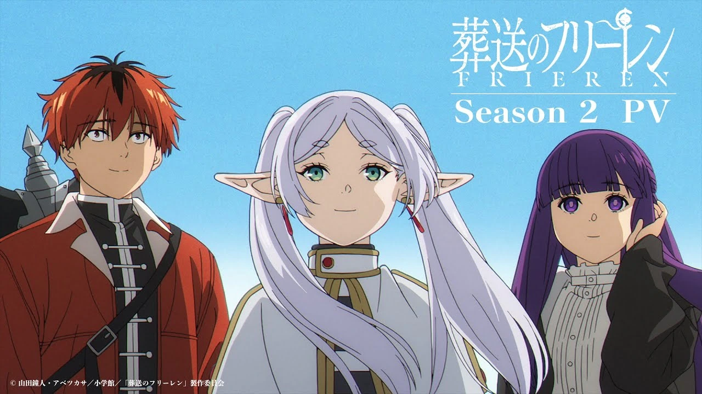
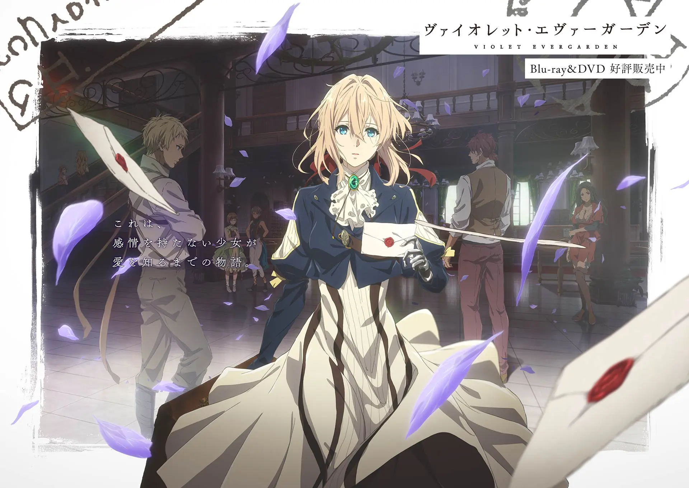
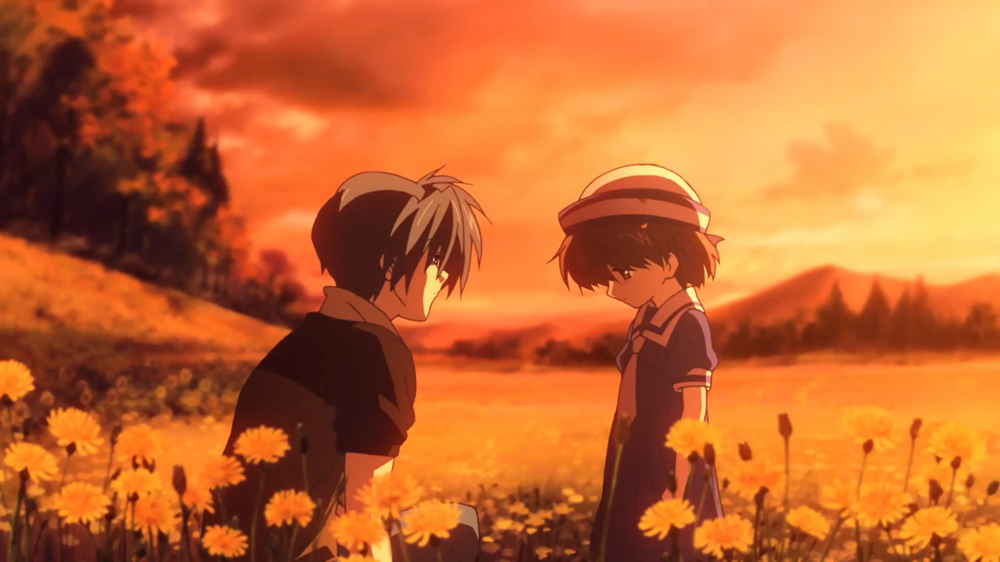
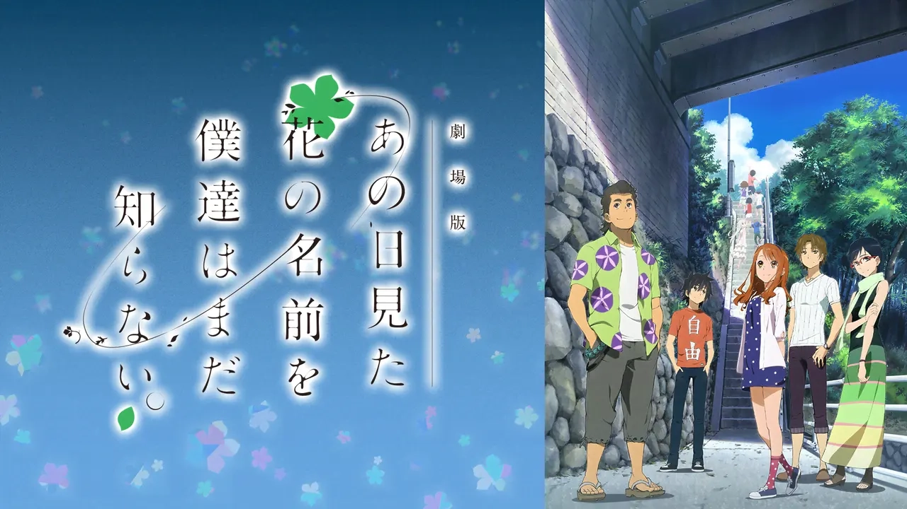
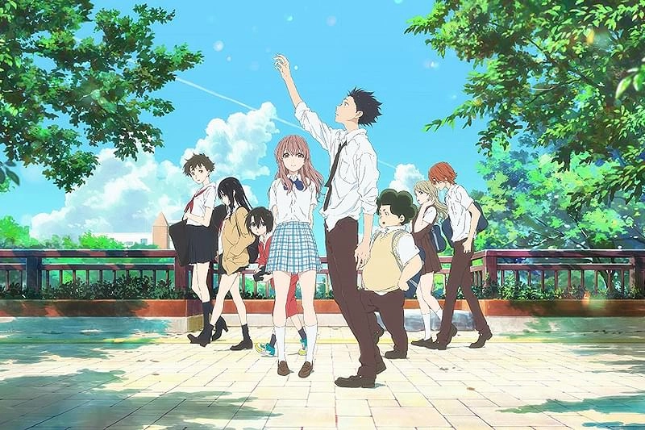

2026年は、派手な展開よりも「感情の余韻」を大切にするアニメが強く評価される年です。

この記事では、観終わったあとに静かに泣ける、時間が経ってから思い出して泣ける、そして人生観に残る――そんな「本気で泣けるアニメ」を5作品紹介します。

## 目次

- [1. 葬送のフリーレン](#1-葬送のフリーレン)
- [2. ヴァイオレット・エヴァーガーデン](#2-ヴァイオレットエヴァーガーデン)
- [3. CLANNAD AFTER STORY](#3-clannad-after-story)
- [4. あの日見た花の名前を僕達はまだ知らない。](#4-あの日見た花の名前を僕達はまだ知らない)
- [5. 聲の形](#5-聲の形)
- [まとめ｜2026年に「泣けるアニメ」を観る意味](#まとめ2026年に泣けるアニメを観る意味)

---

## 1. 葬送のフリーレン

### 泣きポイント：時間・喪失・後悔

勇者一行の旅が「終わった後」から始まる物語。人より遥かに長く生きるエルフ・フリーレンが、人の死や感情を後から理解していく姿が、静かに、しかし深く胸を打ちます。

この作品が特別なのは、大声で泣かせにこないところです。派手な演出もなければ、感動的な音楽で煽ることもありません。それでも、何気ない一言で心を持っていかれる瞬間があります。観ている最中は静かに見つめているだけなのに、観終わったあとにじわっと涙が滲んでくる――そんな体験ができる作品です。

フリーレンが「もっと早く知りたかった」と後悔する場面は、誰もが抱える「あのとき、ああしていれば」という感情と重なります。時間の流れ、失われたもの、後から気づく大切さ。この作品は、そうした普遍的なテーマを丁寧に描いています。

**2026年でも確実に語り継がれる名作**です。まだ観ていない人は、ぜひ時間を取って向き合ってほしい一本です。

---

## 2. ヴァイオレット・エヴァーガーデン

### 泣きポイント：言葉・手紙・愛

「愛してる」という言葉の意味を知らない少女が、人の想いを手紙に綴ることで感情を学んでいく物語。戦争で感情を失った主人公ヴァイオレットが、代筆業を通じて人々の人生に触れ、少しずつ心を取り戻していく過程が描かれます。

この作品の泣き方は独特です。1話完結のエピソードが多いのですが、それぞれの回で泣き方が変わります。ある回では静かに涙が流れ、別の回では声を上げて泣いてしまう。そして、回によっては観終わった数日後に思い出して、また泣いてしまうこともあります。

特に印象的なのは、「感情を言葉にする重み」を描いている点です。誰かに想いを伝えること、それを受け取ること。当たり前のようで、とても難しいことです。ヴァイオレットが綴る手紙には、人の人生が、愛が、後悔が、希望が込められています。

**感情を丁寧に描くアニメの最高峰**と言っても過言ではありません。観た人の多くが「人生が変わった」と言う作品です。

---

## 3. CLANNAD AFTER STORY

### 泣きポイント：家族・人生・現実

「泣けるアニメ」と聞いて、必ず名前が挙がる作品がこれです。学生時代を描いた前半から、社会人になり、家族を持ち、人生そのものを描く後半へ。特に後半は、今観ると破壊力が倍増します。

若い頃に観たときと、大人になってから観たときでは、泣くポイントが全く違います。学生時代には理解できなかった「親の気持ち」「人生の選択」「家族の重み」が、年齢を重ねるごとに深く刺さるようになります。

この作品が描くのは、ファンタジーではなく現実です。仕事、家族、失うこと、それでも生きていくこと。人生の選択が重くのしかかり、最終盤は心が持たないほどの感情の波が押し寄せます。

**覚悟して観るべき一本**です。観るタイミングによって受け取り方が変わる作品なので、何年かおきに観直すのもおすすめです。

---

## 4. あの日見た花の名前を僕達はまだ知らない。

### 泣きポイント：後悔・友情・別れ

幼なじみの死をきっかけに止まった時間が、再び動き出すまでの物語。子どもの頃は仲が良かった6人の仲間が、一人の死によってバラバラになり、それぞれが後悔を抱えて生きている――そんな状況から物語は始まります。

この作品の強みは、一本道のストーリーです。余計な要素を削ぎ落とし、感情の爆発がラストに集約される構成になっています。観ている間はじわじわと心に積み重なり、最終回で一気に感情が溢れ出します。

特にエンディングは反則級です。音楽、演出、声優の演技、すべてが完璧に噛み合い、涙なしでは観られません。1クール(全11話)という短さも、一気に観るのに最適です。

**短編で一気に泣きたい人向け**の作品です。週末の夜、時間を取ってまとめて観ることをおすすめします。

---

## 5. 聲の形

### 泣きポイント：贖罪・孤独・再生

いじめた側・いじめられた側、その両方の「その後」を描く作品。この作品が他の泣けるアニメと違うのは、派手な感動演出が一切ないことです。

主人公は小学生のときに聴覚障害のある少女をいじめ、その結果、自分自身が孤立します。高校生になった彼が、過去の罪と向き合い、償おうとする姿が描かれます。心理描写がリアルで痛く、観ていて胸が苦しくなる場面もあります。

この作品は「感動」というより「心に刺さる」タイプです。静かに、でも深く泣けます。観終わったあとに残るのは、温かい感動というより、何か重いものを受け取ったような感覚です。それでも、最後には希望が見えます。

**人間の弱さと強さ、両方を描いた作品**です。観るのに少し勇気がいるかもしれませんが、観た後には確実に何かが変わります。

---

## まとめ｜2026年に「泣けるアニメ」を観る意味

2026年の「泣けるアニメ」は、無理に泣かせない、感情を押し付けない、観る側に委ねる――そんな作品が強く支持されています。

今回紹介した5作品は、泣くために観るのではなく、観た結果として泣いてしまうアニメです。派手な演出や感動的な音楽で煽るのではなく、静かに、丁寧に、人の感情を描いています。

疲れたとき、立ち止まりたいとき、何かを感じたいとき――ぜひ一度、時間を取って観てみてください。涙を流すことは、心をリセットすることでもあります。そして、これらの作品は、あなたの人生観に何かを残してくれるはずです。